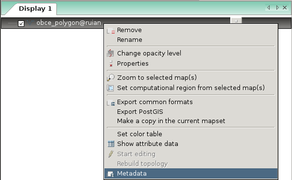

Vektorová data
--------------

Vektorová data jsou v systému GRASS uložena v podobě
tzv. **vektorových map**.

GRASS je striktně **topologický GIS**, vektorová data ukládá v
toopologickém formátu a v případě :ref:`importu vektorových dat
<import-vector>` z netopologických formátů jako je např. :wikipedia-en:`Esri Shapefile`
data převádí do topologické formy automaticky.

Ve 2D GIS rozlišuje tři zákládní **typy geoprvků**:

* bodové (*point*)
* liniové (*linestring*)
* plošné (*polygon*)

.. note::

   Nativní vektorový formát systému GRASS umožňuje na rozdíl od jiných
   formátů jako je např. :wikipedia-en:`Esri Shapefile` uložit v
   jednou souboru (vektorové mapě) rozdílné typy prvků najednou, v
   jedné vektorové mapě tedy mohou být uloženy současně bodové,
   liniové i plošné geoprvky zároveň.

Metadata
========

Základní metadata o vektoré mapě vypisuje modul :grasscmd:`v.info`
dostupný ze menu *správce vrstev* :menuselection:`Vector --> Reports
and statistics --> Basic vector metadata` anebo z kontextového menu.

	    
.. figure:: images/lmgr-v-info-example.png

	    Příklad výpisu metadat vektorové mapy
	    :map:`obce_polygony`.

Topologický model
=================

Topologický model systému GRASS liniové a plošné elementy rozkládá
dále na **topologické elementy**:

* uzel (*node*)
 * každá linie či hraniční linie musí začínat a končit v uzlu
 * linie se musí křížit vždy v uzlu
 * izolované uzly nejsou podporovány
* linie (*line*)
* hraniční linie (*boundary*) a
* reprezentační bod plochy (*centroid*).

Hraniční linie je liniové element, který na rozdíl od elementu
označovaného jako linie může tvořit hranici plochy. Plošný
topologický element *area* je tvořen jednou či více hraničními liniemi
a volitelně i jedním *centroidem*. Izolovaná plocha nebo souvislá
množina ploch formuje plošný element označovaný jako ostrov (*isle*).

Příklad
=======

Na obrázku níže je zobrazen

* jeden bodový geoprvek
* jeden liniový geoprvek
* dva plošné geoprvky, z toho jeden z nich obsahuje otvor

.. figure:: images/grass7-topo.png
	    :class: large

Tato kompozice bude v topologické module systému GRASS vyjádřen
následující topologickými elementy:

* pěti uzly :fignote:`n1-5`
* jednou linií :fignote:`2`
* čtyřmi hraničními liniemi :fignote:`3,4,6,8`
* dvěma centroidy :fignote:`5,7`

Atributová data
===============

.. todo::
