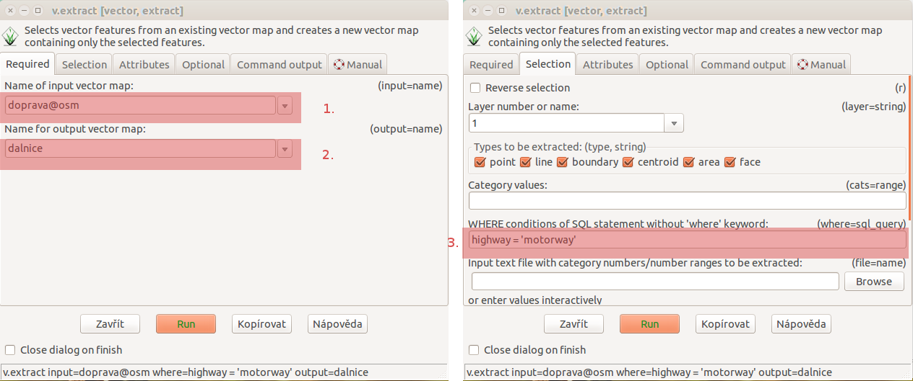
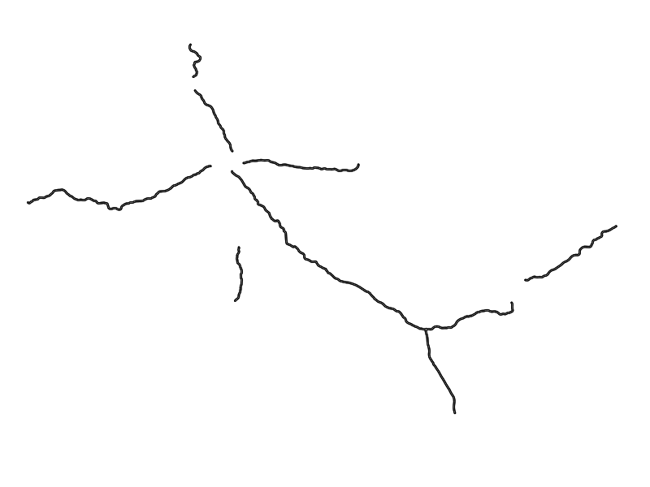

Prostorové funkce
-----------------

.. youtube:: YWRHFylZCuo

             Příklad základních prostorových funkcí (buffer, clip,
             erase) v kombinaci s atributovými dotazy

Výběr z vektorové mapy
~~~~~~~~~~~~~~~~~~~~~~
Z vektorové mapy můžeme vybrat některé prvky a uložit je do nové mapy. Vybírat
můžeme selektivně podle identifikátorů objektu a nebo podle jejich atributů.
Nástroj pro výběr :grassCmd:`v.extract` můžeme spustit z
:menuselection:`Vector --> Feature selection --> Select by attributes`.

.. note:: Ujistěte se, že máte v pracovní cestě přidány všechny *mapsety*,
    abyste mohli pracovat s daty v nich obsaženými. :grassCmd:`g.mapsets` vám
    umožní mapsety do cesty přidat.

Vyberte z vrstvy ``doprava`` z mapsetu ``osm`` a zní všechny dálnice (vektory
splňující podmínku ``highway = 'motorway'``. Uložte výsledek do vrstvy
``dalnice``.

    Tvoření vrstvy ``dalnice`` z OpenStreetMap roads.

Obalová zóna
~~~~~~~~~~~~
Vytvoříme obalovou zónu 500m okolo dálnic. :menuselection:`Vector --> Buffer vector`

    Buffer 500m okolo dálnic, modul :grasscmd:`v.buffer`

