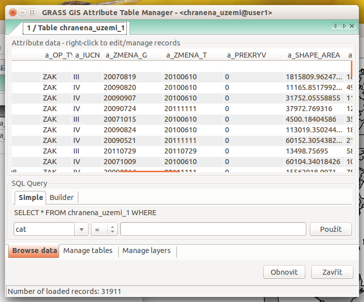
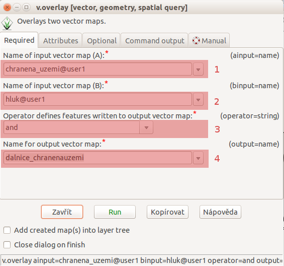
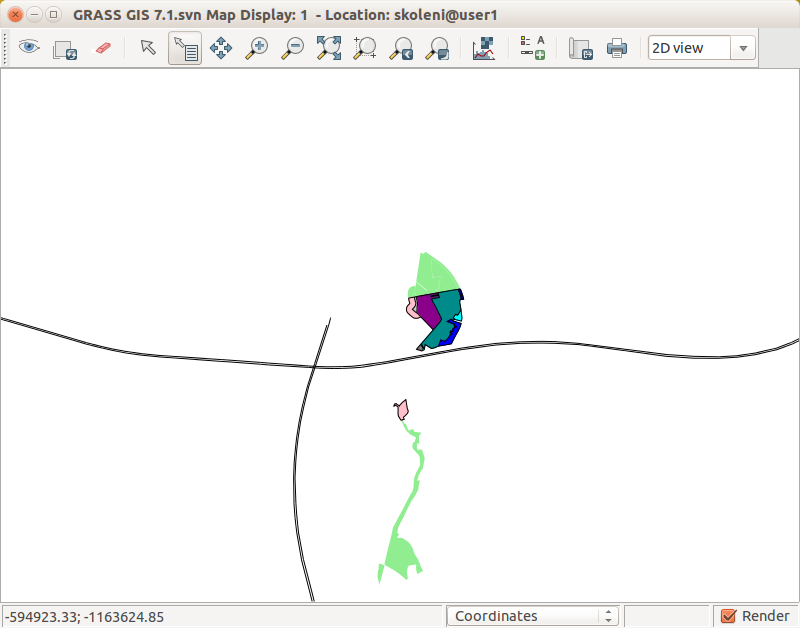
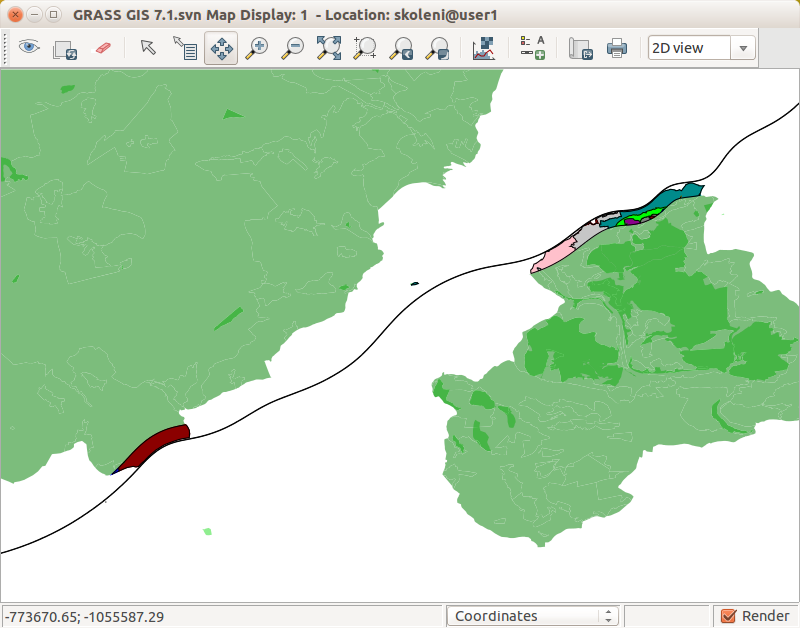
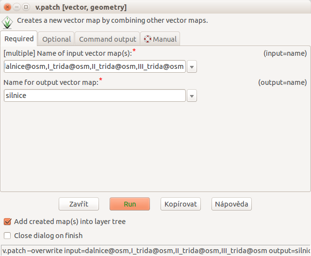

Prostorové funkce
-----------------

.. youtube:: YWRHFylZCuo

             Příklad základních prostorových funkcí (buffer, clip,
             erase) v kombinaci s atributovými dotazy

Výběr z vektorové mapy
~~~~~~~~~~~~~~~~~~~~~~

Z vektorové mapy můžeme vybrat prvky a ty uložit mapy nové. Vybírat
můžeme selektivně podle identifikátorů prvků anebo na základě jejich
atributů.  Nástroj pro výběr :grassCmd:`v.extract` můžeme spustit z
:menuselection:`Vector --> Feature selection --> Select by
attributes`.

.. note:: Ujistěte se, že máte v pracovní cestě přidány všechny
    *mapsety*, abyste mohli pracovat s daty v nich obsaženými, viz
    modul :grassCmd:`g.mapsets`.

V následujím přikladě vybereme z vektorové mapy :map:`doprava` (mapset
:map:`osm`) všechny dálnice (splňující podmínku ``highway =
'motorway'``). Výsledek uložíme do vektorové mapy :map:`dalnice`.

.. figure:: images/v-extract.png
   :class: large
           
   Tvoření tématické vektorové mapy :map:`dalnice` z OpenStreetMap.
            
Obalová zóna
~~~~~~~~~~~~

Obalovou zónu pro vektorová data vytváří modul :grasscmd:`v.buffer`
(:menuselection:`Vector --> Buffer vector`).

.. figure:: images/v-buffer-result.png

   Příklad obalové zóny 500m okolo dálnic

Překrytí, průnik, spojení, vyloučení
------------------------------------

Tyto operace zajišťuje modul :grasscmd:`v.overlay`
(:menuselection:`Vector --> Overlay vector maps --> Overlay vector
maps`).

V našem případě zjistíme, jak moc zasahuje zóna 500m okolo dálnic do
velkoplošných a maloplošných chráněných území.

.. todo:: doplnit...
          
.. Nejprve spojíme velkoplošná a maloplošná území do jedné vrstvy.

Spojení (union)
~~~~~~~~~~~~~~~~~~~

V našem případě vytvoříme vektorovou mapu :map:`chranena_uzemi`
spojením velkoplošných a maloplošných chráněných území.

.. figure:: images/v-overlay-01.png

    Vytvoření mapy maloplošných a velkoplošných chráněných území

Výsledná vektorová mapa má spojenou tabulku atributů z obou vstupních
vektorovových map. Atributy první mapy označeny prefixem ``a_`` a
atributy druhé prefixem ``b_``.

    Atributová tabulka výsledné vektorové mapy :map:`chranene_uzemi`

Průnik (intersect)
~~~~~~~~~~~~~~~~~~

V našem případě zjistíme, jak obalová zóna zasahuje do chráněných
území. Opět spustíme modul :grasscmd:`v.overlay` a použijeme operaci
průnik (operátor ``AND``).

    Dálniční obalová zóna procházející chráněným územím.

           
   Hluková oblast zasahující maloplošné chráněné území Černovický hájek u Brna

        
   Hluková oblast zasahující velkoplošné chráněné území CHKO Česká
   kras a CHKO Křivoklátsko

Podobně fungují i operátory ``XOR`` a ``NOT``.

Spojení vektorových map
-----------------------

Alternativním způsobem spojení vektorových map je modul
:grasscmd:`v.patch`. Na rozdíl od :grasscmd:`v.overlay` tento modul
sloučí vstupní vektorové mapy automaticky.

V tomto příkladu vytvoříme novou mapu :map:`silnice`, která bude
složena ze vstupních vektorových map :map:`dalnice, I_trida, II_trida,
III_trida`.

Spustíme modul :grasscmd:`v.patch` (:menuselection:`Vector --> Overlay
vector maps --> Patch vector maps`).

