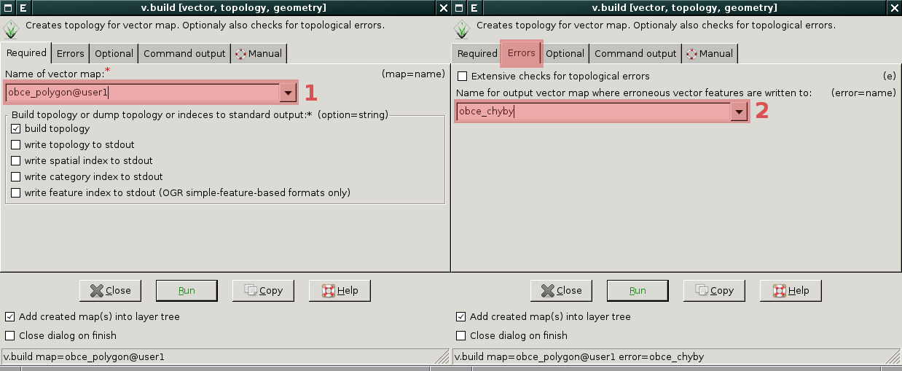

Topologie vektorových dat
=========================

Jak již bylo uvedeno v úvodní části, vektory v prostředí GRASS jsou uloženy v
topologickém formátu. Znamená to, že nad nimi můžeme rychleji provádět celou
řadu operací, které v ne-topologickém formátu jsou daleko náročnější. Toto je na
druhou stranu vyváženo náročnější správou dat a potenciálně větším nebezpečím
jejich poškození.

Pokaždé, je-li nějakým způsobem vytvořen nový vektorový soubor či je-li
stávající soubor upraven nějakým nástrojem, je vždy přebudována topologie k
danému souboru. Tu můžeme znovu vybudovat také ručně modulem
:grasscmd:`v.build`, který můžete spustit z menu :menuselection:`Vector -->
Topology maintenance --> Create or rebuild topology [v.build]`.

.. note:: modulem g.copy si zkopírujte vrstvu ``doprava`` v MAPSETu ``osm`` do
    vašeho pracovního MAPSETu

    Znovu vybudování topologie pro vrstvu doprava (lokální kopie). Chyby v
    topologii uložíme do zvláštní vrstvy

Pro práci s topologií slouží především modul :grasscmd:`v.clean`. Podíváme-li se
do nápovědy k tomuto modulu (modul najdete v :menuselection:`Vector --> 
