.. index::
   pair: popisná data; editace
   single: db.execute
   single: v.db.execute
   single: v.to.db
   pair: field calculator; atributy

Atributová data
---------------
.. _editace-atributovych-dat:

Editace atributových dat
========================

Správce atributových dat umožňuje kromě dotazování (viz kapitola
:doc:`../intro/atributove-dotazy`) atributová data **modifikovat**.

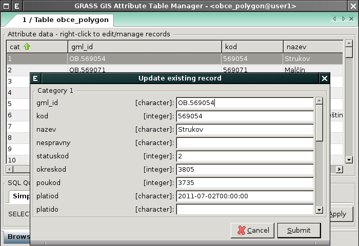
              
.. note:: Editovat lze atributové data vektorových map pouze z
          aktualního mapsetu.

          Kopírovat vektorové mapy do aktuálního mapsetu lze z
          kontextového menu stromu vrstev (:numref:`copy-vector-01`)
          anebo pomocí nástoje ze záložky :item:`Data`
          (:numref:`copy-vector-02`).

          .. _copy-vector-01:
          
          .. figure:: images/copy-vector-01.png
             :class: small
             
             Vytvoření kopie vektorovové mapy v aktuálním mapsetu z
             kontextového menu správce vrstev.

          .. _copy-vector-02:
          
          .. figure:: images/copy-vector-02.png
             :class: middle

             Kopírování vektorových map pomocí nástroje ze záložky
             :item:`Data`.

..                   
  .. youtube:: UZswOcIyaX8

             Editace záznamů v atributové tabulce

.. notecmd:: Editace atributových dat

               Nabízejí se dva moduly:

             * :grasscmd:`db.execute` umožňující spustit jakýkoliv
               :abbr:`SQL (Structured Query Language)` příkaz typu
               ``UPDATE``, ``ALTER`` či ``DELETE``

               .. code-block:: bash
                               
                  db.execute sql="update obce set nespravny = '1' where kod = 569054"

             * anebo :grasscmd:`v.db.update` jako frontend pro vektorové mapy

               .. code-block:: bash
               
                  v.db.update map=obce column=nespravny value="1" where="kod = 569054"

Správce atributových dat umožňuje **přidávat** do atributové tabulky
nové záznamy.

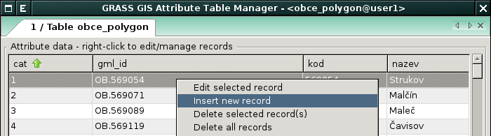

   Přidání nového záznamu do atributové tabulky.

.. note:: Tato operace neznamená, že bude do vektorové mapy přidán
   nový prvek.

.. 
   .. youtube:: mmPvMRBDxLg

   Přidání nového záznamu do atributové tabulky.

.. notecmd:: Vložení nového záznamu do atributové tabulky

   .. code-block:: bash

      db.execute sql="insert into obce_polygon(cat, nazev) values (6253, 'pokus')"

Vybrané záznamy lze z atributové tabulky **odstranit**.

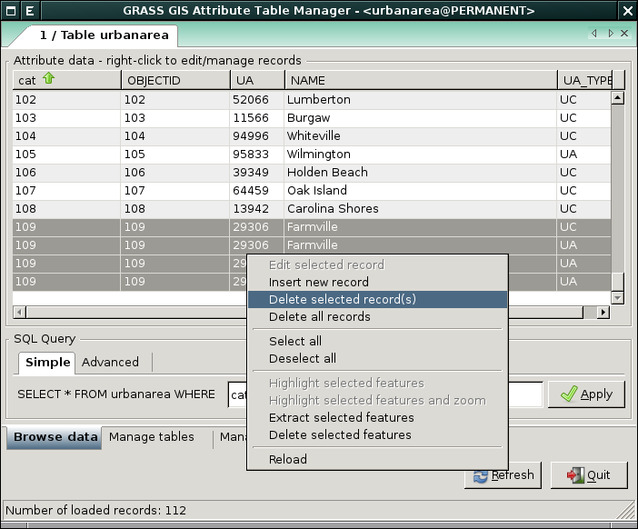
                 
            Odstranění záznamů z atributové tabulky.

.. notecmd:: Odstranění záznamů z atributové tabulky

   .. code-block:: bash

      db.execute sql="delete from obce where cat = 6253"

.. important::

   Při odstranění či přidání záznamů do atributové tabulky dochází k
   modifikaci pouze popisné složky geoprvků. Např. při odstranění
   záznamu z atributové tabulky zůstává asociovaná geometrická složka
   popisu geoprvku ve vektorové mapě zachována.

Numerické atributy mohou být také *vypočítány* na základě zvolené funkce.

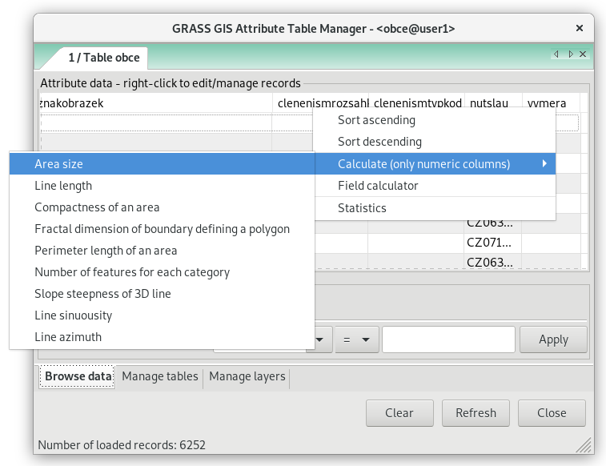

   Funkce pro výpočet numerických atributů.

.. raw:: latex

   \newpage

.. notecmd:: Výpočet hodnoty atributu
             
   .. code-block:: bash
                   
      v.to.db map=obce option=area columns=vymera

.. _pridani-noveho-atributu:
            
Příklad přidání nového atributu s výměrou a její výpočet (ve
čtverečních mapových jednotkách).

.. 
  .. youtube:: qkXgQXF1QkA

             Přidání nového sloupce do atributové tabulky a výpočet plochy

.. _field-calculator:
                
Field Calculator
================

*Field Calculator* je nástroj, který umožňuje sestavit :abbr:`SQL
(Structured Query Language)` UPDATE příkaz a pomocí něho modifikovat
atributová data.

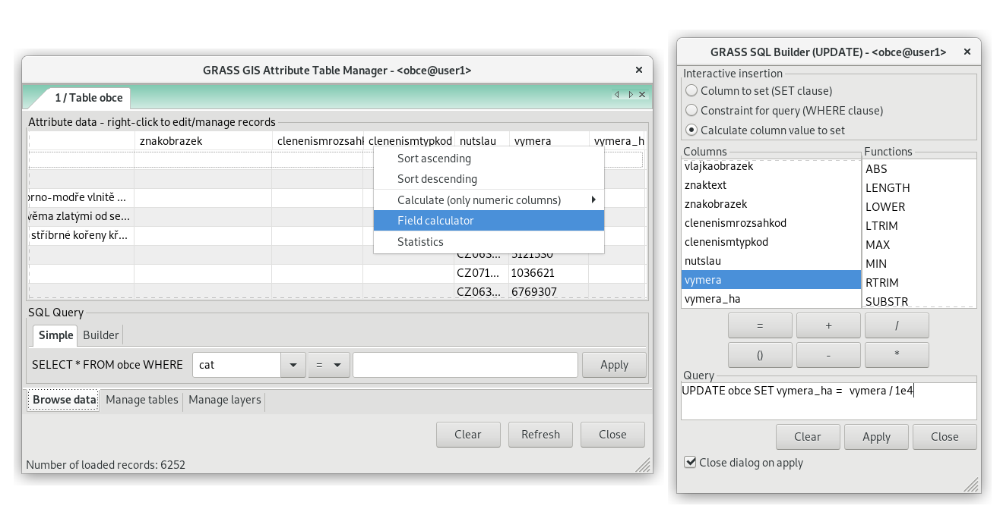
           
   Ukázka nástroje využití Field Calculator.

..   
   .. youtube:: 44KmtnBJtgo

   Výpočet poměru obvodu a výměry plochy pomocí Field Calculatoru.

.. _db-select:

Pokročilé dotazování
====================

Atributové dotazy umožňují dva moduly :ref:`v.db.select
<modul-v-db-select>` a :ref:`db.select <modul-db-select>`.

.. _modul-v-db-select:

Modul v.db.select
^^^^^^^^^^^^^^^^^

Modul :grasscmd:`v.db.select` umožňuje provádět dotazy pouze nad
atributovými daty připojenými k dané vektorové mapě. Je dostupný z
menu :menuselection:`Database --> Query --> Query vector attribute
data`. Pokud není zadána :option:`where` podmínka, tak modul vypíše
všechny záznamy z atributové tabulky.

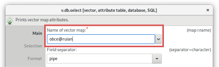

   Atributový dotaz pomocí modulu :grasscmd:`v.db.select`
   (zadání vektorové mapy).

.. raw:: latex

   \newpage

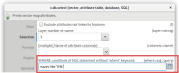

   Atributový dotaz pomocí modulu :grasscmd:`v.db.select`
   (volitelně zadání 'where' podmínky).

.. _modul-db-select:

Modul db.select
^^^^^^^^^^^^^^^

Modul :grasscmd:`db.select` umožňuje provádět :abbr:`SQL (Structured
Query Language)` dotazy (SELECT) nad *libovolnými* atributovými daty
dostupnými pomocí daného databázového ovladače. :abbr:`SQL (Structured
Query Language)` dotazy mohou být uloženy v souboru (parametr
:option:`input`) anebo definovány jako parametr :option:`sql`. Tento
modul je dostupný z menu :menuselection:`Database --> Query --> Query
any table`.

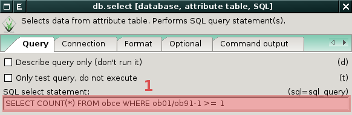
            
            Atributový dotaz pomocí modulu :grasscmd:`db.select`
            (zadání :abbr:`SQL (Structured Query Language)`
            dotazu). Výpočet plošné zakulacenosti prvků (poměr
            kvadrátu obvodu vůči ploše).

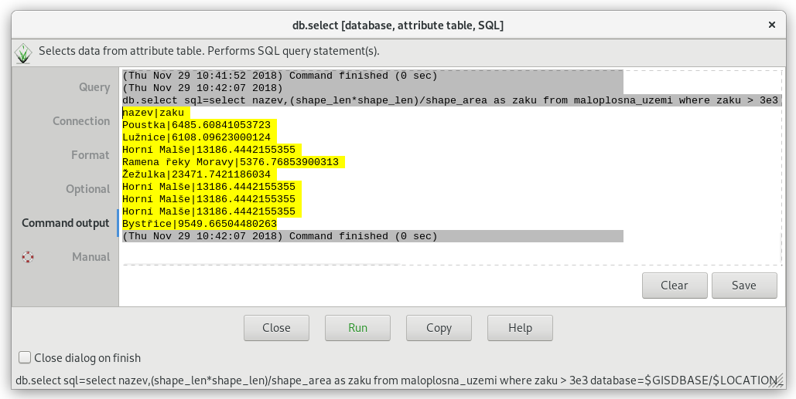

            Atributový dotaz pomocí modulu :grasscmd:`db.select`
            (výsledek :abbr:`SQL (Structured Query Language)` dotazu).

.. important:: Modul :grasscmd:`db.select` pracuje s atributy uloženými
   v aktuální mapsetu (ve výchozím nastavení systém GRASS použivá pro
   uložení atributových dat SQLite databázi, každý mapset má svoji
   DB). Cestu k DB lze změnit pomocí atributu :param:`database`.
              
.. raw:: latex

   \newpage

.. notecmd:: Jednoduché atributové dotazu

   .. code-block:: bash

      db.select sql="select nazev,(shape_len*shape_len)/shape_area as zaku from maloplosna_uzemi where zaku > 3e3"

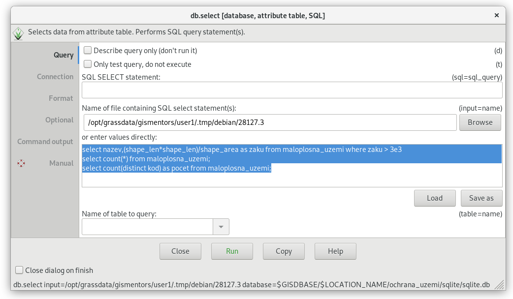

   Vícenásobný atributový dotaz pomocí modulu :grasscmd:`db.select`
   (zadání :abbr:`SQL (Structured Query Language)` dotazů).

.. code-block:: sql

   select nazev,(shape_len*shape_len)/shape_area as zaku from maloplosna_uzemi where zaku > 3e3;
   select count(*) from maloplosna_uzemi;
   select count(distinct kod) as pocet from maloplosna_uzemi;

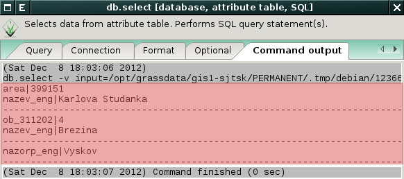

   Vícenásobný atributový dotaz pomocí modulu :grasscmd:`db.select`
   (výsledek :abbr:`SQL (Structured Query Language)` dotazů).

.. note::

   Pro ostatní :abbr:`SQL (Structured Query Language)` příkazy
   (``INSERT``, ``UPDATE``, ``DELETE``, ``ALTER`` a další) je určen
   modul :grasscmd:`db.execute`.
