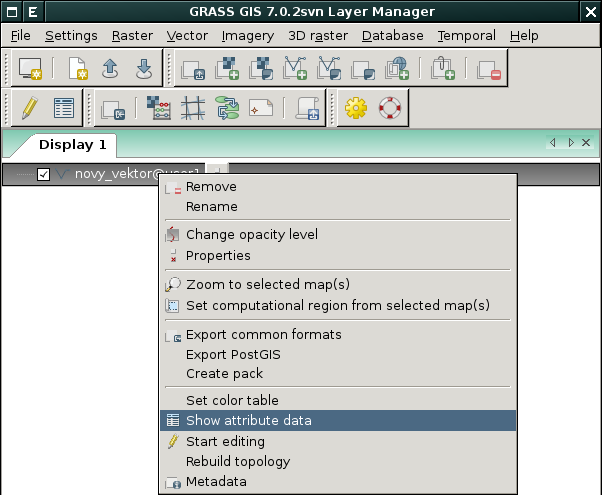
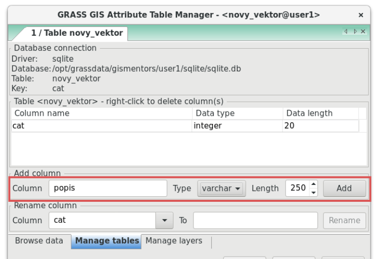
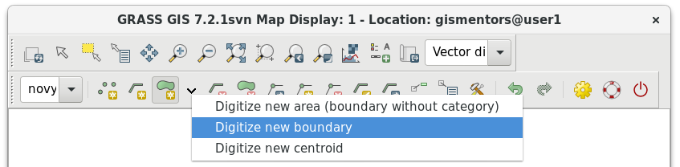

.. index::
   pair: vektorová data; editace
   single: v.edit
   single: g.gui.vdigit
   see: editace; topologie

Editace vektorových dat
-----------------------

Vytvoření nové vektorové mapy
=============================

Novou vektorovou mapu vytvoříme z menu :menuselection:`Vector -->
Develop vector map --> Create new vector map`.

.. figure:: images/create-vector.png
   :class: small
   :scale-latex: 60

   Dialog pro vytvoření nové vektorové mapy.

.. noteadvanced::
      
   Klíč (*key column*) označuje v dialogovém okně název atributu,
   který bude sloužit pro definovaní vazby mezi geometrickou a
   atributovou částí popisu geoprvků, ve výchozím nastavení se jedná o
   atribut ``cat``, viz kapitola :ref:`atributova-data`.

   .. notecmd:: Vytvoření prázdné vektorové mapy

      .. code-block:: bash 
    
         v.edit map=novy_vektor tool=create

Vytvoření a úprava atributové tabulky
~~~~~~~~~~~~~~~~~~~~~~~~~~~~~~~~~~~~~

Nástroj pro editaci atributové tabulky otevřeme z nástrojové lišty
*správce vrstev* |grass-table| :sup:`Show attribute data for selected
vector map` anebo z kontextového menu vektorové mapy :item:`Show
attribute data`.

.. raw:: latex

   \newpage

   Spuštění správce atributových dat.

Přidávat či přejmenovávat atributy lze v záložce :item:`Manage
tables`, více v kapitole :ref:`editace-atributovych-dat`.

   
   Přidání nového atributu s názvem ``popis``.

.. _editace-vektorovych-dat:

Editace vektorové mapy
======================

Editaci vektorové mapy aktivujeme z nástrojové lišty *správce vrstev*
|grass-edit| :sup:`Edit selected vector map` anebo z kontextového menu
:item:`Start editing`.

.. raw:: latex

   \newpage
         
.. figure:: images/edit-vector-01.png
   :scale-latex: 50
     
   Spuštění editace vektorových dat z kontextového menu správce vrstev.
    
Nyní můžeme v mapovém okně zvolit nástroj kreslení bodu
|grass-point-create| :sup:`Digitize new point`, linie
|grass-line-create| :sup:`Digitize new line` anebo |grass-polygon-create|
:sup:`Digitize new area` a nakreslit požadovaný tvar.

.. tip:: Mapové okno bude zobrazovat podkladové mapy, které v něm byly načteny
         dříve.

Po ukončení editace geoprvku (pravým tlačítkem) se objeví formulář pro vyplnění
atributů.

.. figure:: images/edit-vector-02.png
   :class: middle
   :scale-latex: 65

   Definice atributů pro nově vytvořený vektorový geoprvek.

.. tip::
      
   Počáteční a koncové body (tzv. uzly) linií a hranic ploch budou na
   sebe automaticky přichyceny. Výchozí hodnotu `10px` je možné změnit
   v nastavení |grass-settings| :sup:`Digitization settings` v sekci
   :item:`General` ``Snapping threshold``.

   Uzly jsou vykresleny různou barvou, podle toho jsou-li přichyceny k
   dalšímu uzlu či nikoliv. Podobně jsou zvýrazněna i ostatní
   topologická primitiva jako linie, hraniční linie a centroidy, viz
   záložka :item:`Symbology`.

Každá plocha |grass-polygon-create| :sup:`Digitize new area`
automaticky *zaplochována* centroidem. K centroidu lze později navázat
požadované atributy plochy. Hranice plochy a jejich centroidy lze také
editovat zvlášť.

Mazání vybraných prvků |grass-line-delete| :sup:`Delete selected
point(s), line(s), boundary(ies) or centroid(s)`
|grass-polygon-delete| :sup:`Delete selected area(s)` je potřeba vždy
potvrdit pravým tlačítkem myši.

V nastavení editace můžeme nastavit zobrazení editovaných prvků (šířka, barvy),
přichytávání, automatické přiřazování atributů novým prvkům a další.

Editaci ukončíme z nástrojové lišty |grass-edit| anebo z kontextového
menu :item:`Stop editing`.

.. noteadvanced:: Editovat vektorové prvky lze v příkazové řádce
    pomocí modulu :grassCmd:`v.edit`, což se může hodit především při
    skriptování.
