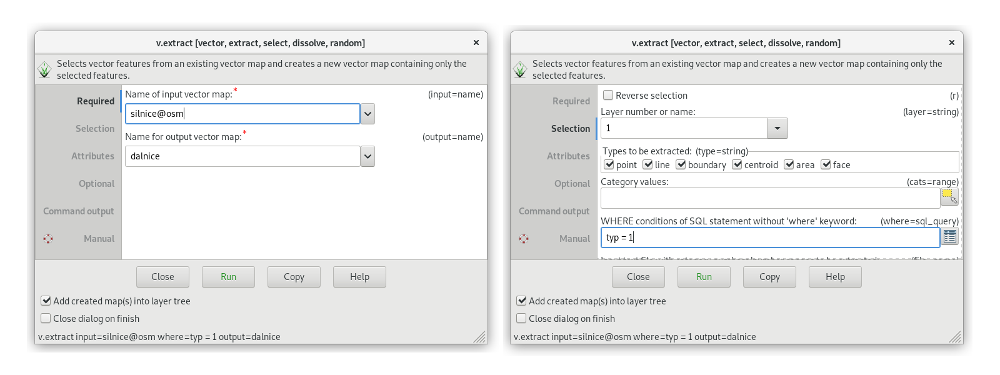
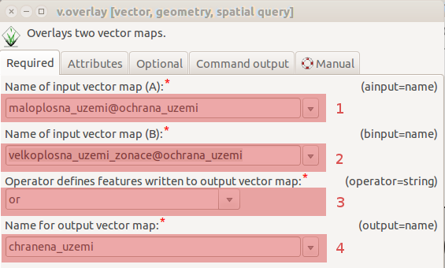
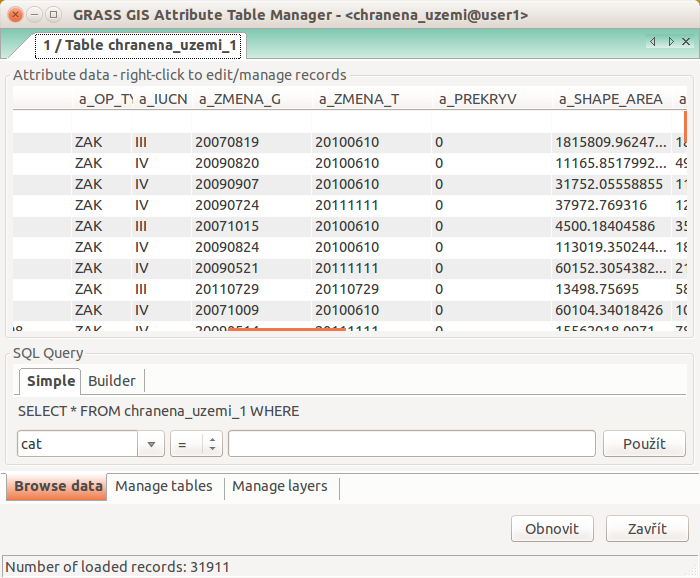
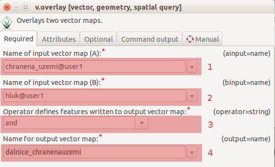
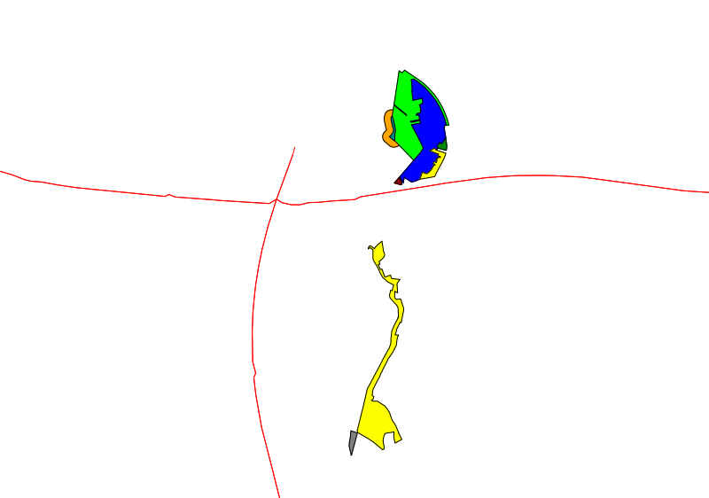
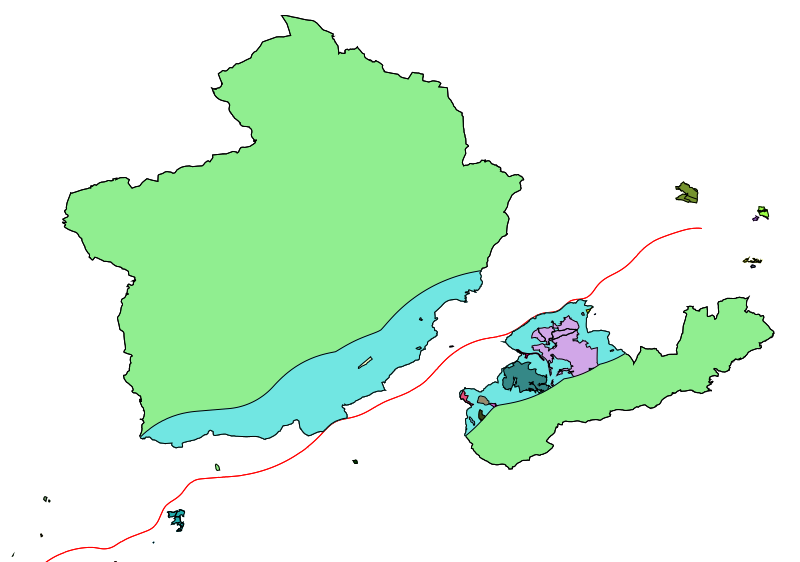
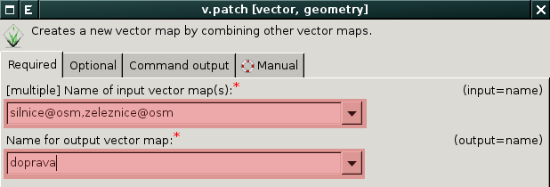
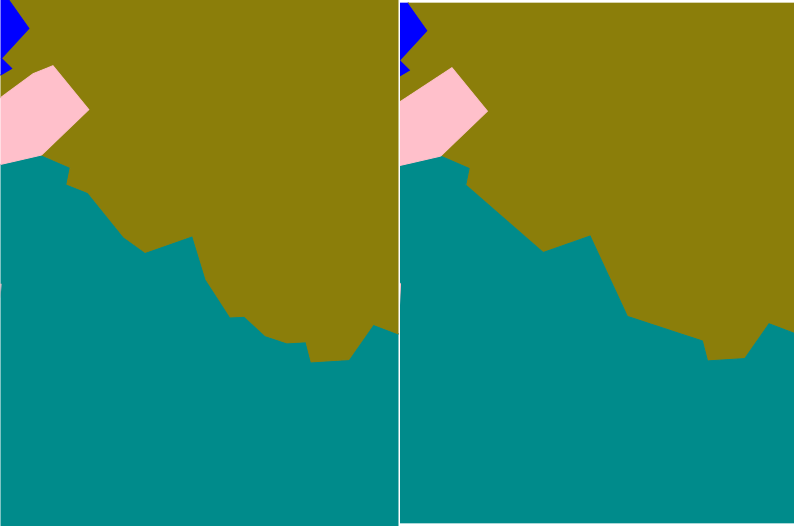

.. index::
   pair: vektorová data; prostorové funkce

Prostorové funkce
-----------------

.. youtube:: YWRHFylZCuo

   Příklad základních prostorových funkcí (buffer, clip, erase) v
    kombinaci s atributovými dotazy.

.. index::
   single: v.extract
   see: prostorové funkce; v.extract

.. _v-extract:
             
Výběr z vektorové mapy
======================

Vybírat geoprvky z vektorové mapy můžeme selektivně podle jejich
kategorií a atributů, viz kapitola :doc:`../intro/atributove-dotazy`.
Nástroj pro výběr :grassCmd:`v.extract` je dostupný z menu
:menuselection:`Vector --> Feature selection --> Select by
attributes`.

.. tip:: Ujistěte se, že máte :ref:`v pracovní cestě <g-mapsets>`
    přidány všechny *mapsety* tak, abyste mohli pracovat s daty v nich
    obsaženými.

V následující ukázce vybereme z vektorové mapy :map:`silnice` (mapset
:map:`osm`) všechny dálnice (splňující podmínku ``typ = 1``). Výsledek
uložíme do vektorové mapy :map:`dalnice`.

              
   Vytvoření tématické vektorové mapy :map:`dalnice`.

.. index::
   pair: obalová zóna; buffer
   single: v.buffer
   see: prostorové funkce; v.buffer

Obalová zóna
============

Obalovou zónu pro vektorová data vytváří modul :grasscmd:`v.buffer`
(:menuselection:`Vector --> Buffer vector`).

Příklad vytvoření obalové zóny s šířkou 5 km.

.. code-block:: bash

   v.buffer input=dalnice output=hluk distance=5000

.. figure:: images/v-buffer-result.png
   :class: middle
   :scale-latex: 65
        
   Příklad obalové zóny 5 km okolo dálnic.

.. index::
   single: intersect
   single: union
   single: v.overlay
   see: prostorové funkce; v.overlay

Překrytí, průnik, spojení, vyloučení
====================================

Tyto operace zajišťuje modul :grasscmd:`v.overlay`
(:menuselection:`Vector --> Overlay vector maps --> Overlay vector
maps`).

Překrytí (union)
^^^^^^^^^^^^^^^^

V našem případě vytvoříme vektorovou mapu :map:`chranena_uzemi`
:fignote:`(4)` spojením :fignote:`(3)` velkoplošných :fignote:`(2)` a
maloplošných chráněných území :fignote:`(1)`.

   
   Vytvoření mapy maloplošných a velkoplošných chráněných území.

.. notecmd:: Spuštění

   .. code-block:: bash
                   
      v.overlay ainput=maloplosna_uzemi binput=velkoplosna_uzemi operator=or \
       output=chranena_uzemi
                   
K výsledné vektorové mapě je přiřazena atributová tabulka, která je
spojena z obou vstupních vektorových map. Atributy první vektorové
mapy (:option:`ainput`) jsou označeny prefixem ``a_``, atributy druhé
(:option:`binput`) prefixem ``b_``.

   Atributová tabulka výsledné vektorové mapy :map:`chranene_uzemi`.

Průnik (intersect)
^^^^^^^^^^^^^^^^^^

V tomto případě zjistíme, jak obalová zóna dálnic :fignote:`(2)`
zasahuje do chráněných území :fignote:`(1)`. Opět spustíme modul
:grasscmd:`v.overlay` a použijeme operaci průnik (operátor ``AND`` -
:fignote:`(3)`).

    Dálniční obalová zóna procházející chráněným územím.

.. notecmd:: Spuštění

   .. code-block:: bash

      v.overlay ainput=chranena_uzemi binput=hluk operator=and \
       output=dalnice_chranenauzemi
                

   Hluková oblast zasahující maloplošné chráněné území Černovický hájek u Brna.

.. raw:: latex

   \newpage
      

        
   Hluková oblast zasahující velkoplošné chráněné území CHKO Česká
   kras a CHKO Křivoklátsko.

Podobně fungují i operátory ``XOR`` a ``NOT``.

.. index::
   single: merge
   single: patch
   single: v.patch
   see: prostorové funkce; v.patch

Spojení vektorových map (merge)
===============================

Alternativním způsob spojení vektorových map umožňuje modul
:grasscmd:`v.patch` (:menuselection:`Vector --> Overlay vector maps
--> Patch vector maps`). Na rozdíl od :grasscmd:`v.overlay` tento
modul sloučí vstupní vektorové mapy automaticky.

   Příklad vytvoření nové vektorové mapy :map:`doprava`, která je
   složena ze vstupních vektorových map :map:`silnice` a :map:`zeleznice`.

.. notecmd:: Spuštění

   .. code-block:: bash
                
      v.patch input=silnice,zeleznice output=doprava

Generalizace vektorových prvků
==============================

Proces generalizace vektorových prvků umožňuje modul
:grasscmd:`v.generalize`. Kromě generalizace (zobecnění,
zjednodušení - *simplification*) lze tento modul použít i pro opačný
proces, tj. vyhlazení (*smoothing*). Modul podporuje celou řadu
generalizačních algoritmů, viz :grasscmd:`dokumentace modulu
<v.generalize>`. V následujících ukázkách je použit algoritmus
:wikipedia-en:`Ramer–Douglas–Peucker algorithm`.

Následuje příklad generalizace liniových prvků. Příkaz vypisuje
procento zachovaných lomových bodů.

.. code-block:: bash

   v.generalize input=zeleznice output=zelenice_g method=douglas threshold=100

::

   v.generalize complete. Number of vertices for selected features reduced
   from 409477 to 85018 (20% remaining)

.. figure:: images/generalize-line.png

   Příklad generalizace linových vektorových prvků železnic (původní
   prvek černou barvou, generalizovaný červeně).
   
Vzhledem k tomu, že je GRASS GIS :ref:`topologický GIS
<import-topologie>`, tak proces generalizace plošných prvků
automaticky zachovává prostorovou topologii prvků, viz příklad
generalizace vrstvy obcí.

.. code-block:: bash

   v.generalize input=obce@ruian output=obce_g method=douglas threshold=20

   
   Příklad generalizace plošných vektorových prvků obcí (vlevo původní
   prvky, vpravo generalizované).
   
   
